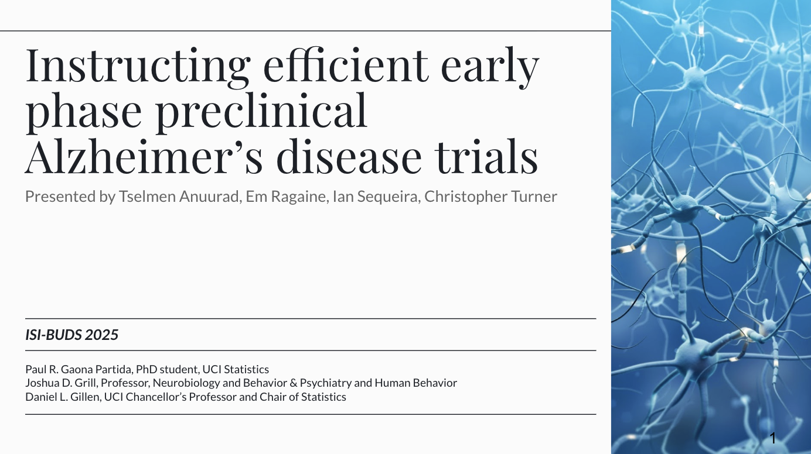
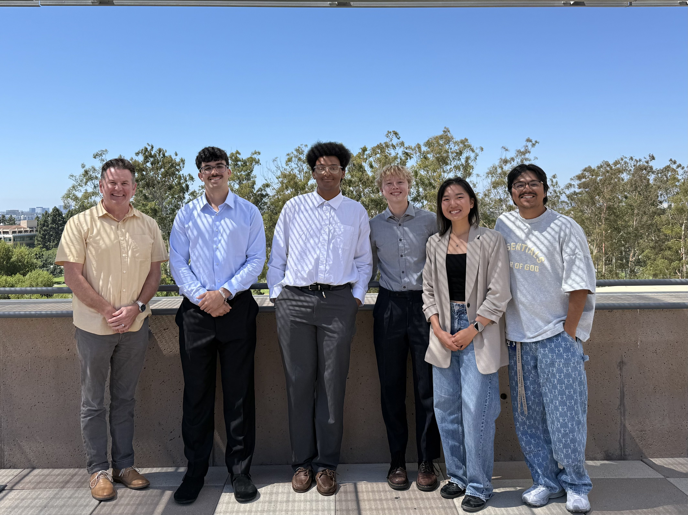

### Research Highlight: Summer Institute of Biostatistics (2025)

During my SIBS research internship at UC Irvine, I applied statistical modeling to identify optimal cognitive endpoints for future preclinical Alzheimer's Disease clinical trials. Our study abstract was accepted for publication in the *Journal of Prevention of Alzheimer’s Disease (JPAD)* and presented at the 18th *Clinical Trials on Alzheimer's Disease* (Dec 2025). 

::: {layout-ncol=2}

:::

### UCLA Stats Calculator 

I had the opportunity to lead a 3-person team to develop the UCLA Stats Calculator under the supervision of Professor Thomas Maierhofer at the Department of Statistics. Built as an R Shiny web app, this pedagogical tool simplifies critical-value calculations and serves as a general-purpose calculator for common statistical tests and confidence intervals. Our work led to the application being officially hosted online by the UCLA Statistics Department for use in introductory courses. As of March 2026, the project has been handed over to a successor student team who is actively expanding its functionality!

Key features:

*  Live, reactive output: results update instantly as you type; no “Calculate” button needed

*  Clean summary tables: every procedure produces a concise table showing the null and alternative hypothesis, sample estimates, p‑value, and test conclusions at α = 0.01, 0.05, 0.10

*  One‑click options: easily toggle confidence intervals, choose between proportion vs. raw successes, overlay the standard normal curve, and more

*  Student‑friendly interface: intuitive inputs, UCLA colors (#2774AE), and a theme that scales nicely to phones for in‑lab use